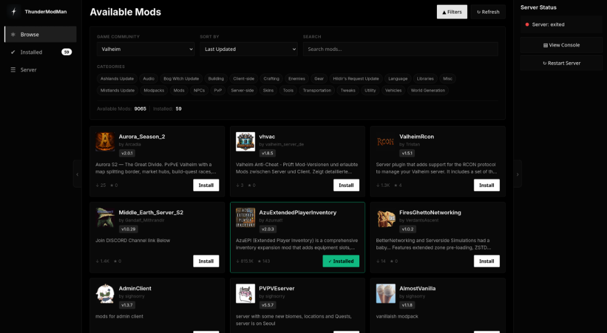
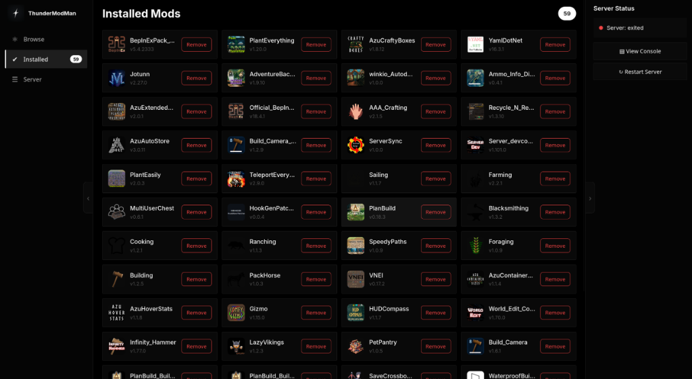
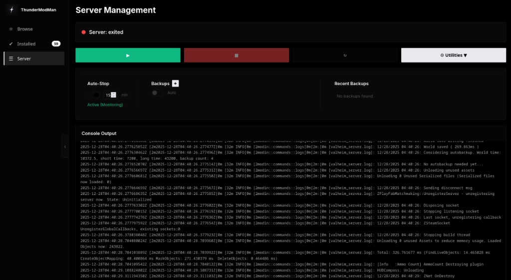

#  ThunderModMan

A lightweight, web-based mod manager for game servers. Browse and install mods from [Thunderstore](https://thunderstore.io) directly through your browser. Currently works out of the box only with Valheim.

[](https://ko-fi.com/lulfloot)


## Features

- ♦ **Valheim Optimized** – The included Docker stack is configured specifically for Valheim.
- ○ **Browse & Search** – Find mods directly from Thunderstore.
- ↓ **One-click Install** – Automatic download and extraction to your server.
- ○ **Dependency Handling** – Installs required dependencies automatically.
- ↺ **Server Control** – Start, stop, and restart your game server from the UI. Auto-Stop setting will stop the server after x minutes of inactivity.
- ≡ **Modern UI** – Dark theme with tabbed navigation and inline console.

> **Important:** The provided `docker-compose.yml` and configuration are hardcoded for **Valheim**. To use this tool with other Thunderstore-supported games (like Lethal Company, Risk of Rain 2, etc.), you **must** modify the docker-compose stack to use the appropriate game server container and volumes.

## Disclaimer: AI

This project was created with the assistance of Artificial Intelligence. While efforts have been made to ensure code quality and functionality, there may be quirks or limitations. Use at your own risk, and feel free to contribute!

## Screenshots

### Browse Mods



### Manage Installed Mods



### Server Management



## Quick Start

### Option 1: Valheim One-Click Stack (Recommended)

This is the easiest way to get started. It includes a pre-configured Valheim server and ThunderModMan ready to go.

1.  Clone the repo:

    ```bash
    git clone https://github.com/<username>/thundermodman.git
    cd thundermodman
    ```

2.  Set up your configuration:

    ```bash
    # Copy example configs
    cp example.env .env
    cp example.docker-compose.yml docker-compose.yml

    # Edit .env with your settings (server name, password, etc.)
    nano .env
    ```

3.  Start the stack:
    ```bash
    docker compose up -d
    ```

> **Note:** Your personal `.env` and `docker-compose.yml` files are gitignored, so you can safely `git pull` updates.

### Option 2: Custom / Standalone (Advanced)

**⚠️ Warning: This method is intended for advanced users.**
If you want to use this with games _other than Valheim_, or integrate it into an existing stack, you will need **manual configuration** and **Docker knowledge**. You must ensure you mount the correct volume paths for your specific game server container.

Use this command as a template:

```bash
docker run -d \
  --name thundermodman \
  -p 9876:9876 \
  -v /path/to/your/bepinex/plugins:/mods \
  -v thundermodman-data:/data \
  thundermodman:latest
```

Then open **http://localhost:9876** to manage mods.

## Configuration

### Environment Variables

| Variable            | Default           | Description                                |
| ------------------- | ----------------- | ------------------------------------------ |
| `PORT`              | 9876              | Web UI port                                |
| `MODS_DIR`          | /mods             | Directory to install mods                  |
| `DATA_DIR`          | /data             | Data directory for tracking installed mods |
| `RESTART_CONTAINER` | -                 | Container name for server control          |
| `SERVER_NAME`       | My Valheim Server | Game server display name                   |
| `WORLD_NAME`        | MyWorld           | World/save name                            |
| `SERVER_PASSWORD`   | changeme          | Server password                            |
| `TZ`                | UTC               | Timezone                                   |

### Enabling Server Control

To allow ThunderModMan to start, stop, and restart your game server:

```bash
docker run -d \
  --name thundermodman \
  -p 9876:9876 \
  -v /path/to/bepinex/plugins:/mods \
  -v thundermodman-data:/data \
  -v /var/run/docker.sock:/var/run/docker.sock \
  -e RESTART_CONTAINER=your-game-server-container \
  thundermodman:latest
```

## Supported Games

Any game supported by Thunderstore with BepInEx mods _should_ work if configured correctly.

**Tested:**

- [✓] Valheim (Full support via included stack)

**Untested (Requires custom stack configuration):**

- [?] Lethal Company
- [?] Risk of Rain 2
- [?] Content Warning
- [?] GTFO
- [?] Vintage Story

**Help needed:** If you test this with other games, please let us know or open a PR!

## Volume Mount Examples

| Game           | Container         | Mod Path                              |
| -------------- | ----------------- | ------------------------------------- |
| Valheim        | mbround18/valheim | `/home/steam/valheim/BepInEx/plugins` |
| Valheim        | lloesche/valheim  | `/config/bepinex/plugins`             |
| Lethal Company | -                 | `/game/BepInEx/plugins`               |

## Development

Run locally without Docker:

```bash
npm install
npm run dev
```

The server will start on http://localhost:9876

## API

| Method | Endpoint                             | Description          |
| ------ | ------------------------------------ | -------------------- |
| GET    | `/api/communities`                   | List supported games |
| GET    | `/api/packages/:community`           | Get mods for a game  |
| GET    | `/api/packages/:community/search?q=` | Search mods          |
| GET    | `/api/installed`                     | List installed mods  |
| POST   | `/api/install`                       | Install a mod        |
| DELETE | `/api/uninstall/:fullName`           | Uninstall a mod      |
| POST   | `/api/start-server`                  | Start game server    |
| POST   | `/api/stop-server`                   | Stop game server     |
| POST   | `/api/restart-server`                | Restart game server  |
| GET    | `/api/server-status`                 | Get server status    |
| GET    | `/api/server-logs`                   | Get server logs      |

## License

MIT
